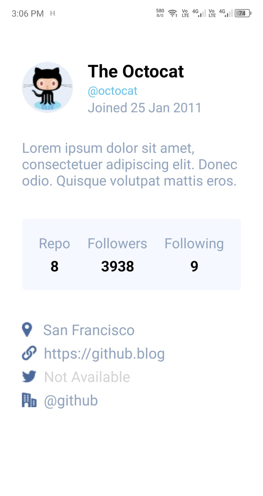

# Octocat Profile Assignment-1

## Description

This a React Native designed Practice Assignment.

## Installation

To run this project locally, follow these steps:

1. Clone this repository.
2. Navigate to the project directory.
3. Run `npm install` to install the dependencies.
4. Run `npm start` to start the development server.

## Technologies Used

- React Native
- Expo

## Credits

This project is created by:

- Abdullah Al Mubin
